# Capstone: Diabetes Indicators in Pima Indian and German (Dutch) Women
## by Debbie Pappas


## <span style="background-color:yellow">Introduction to the Pima Indians</span>

>The Pima are a group of Native Americans living in an area consisting of what is now central and southern Arizona.  
The Keli Akimel O'odham and the Onk Akimel O'odham communities have various environmentally based health issues related to the decline of their traditional economy and farming. They have the highest prevalence of type 2 diabetes in the world, much more than is observed in other U.S. populations. While they do not have a greater risk than other tribes, the Pima people have been the subject of intensive study of diabetes, in part because they form a homogeneous group.  
(**Reference:** https://en.wikipedia.org/wiki/Pima_people)  
(**Notes:** Pima Indians live in the Keli Akimel O'odham and the Onk Akimel O'odham communities)

## <span style="background-color:yellow">Introduction to People from Frankfurt, Germany</span>

>The city of Frankfurt is culturally and ethnically diverse, with 51.2% of the population having an immigrant background in 2015. For the first time in the city's history, the majority of its residents had a non-German background. What's more, three-quarters of children under six had immigrant backgrounds, and 27.7% of those living in the city had foreign citizenship. Home to as many as 180 nationalities, Frankfurt is very much a multicultural city.   
(**Reference:** https://worldpopulationreview.com/world-cities/frankfurt-population/)  
German health benefits are very generous. And there's usually little or no wait to get elective surgery or diagnostic tests, such as MRIs. It's one of the world's best health care systems, visible in little ways that most Germans take for granted.  
(**Reference:** https://www.npr.org/templates/story/story.php?storyId=91971406 )

## <span style="background-color:yellow">Introduction to Diabetes</span>

>Diabetes is a disease that occurs when your blood glucose, also called blood sugar, is too high.Insulin, a hormone made by the pancreas, helps glucose from food get into your cells to be used for energy.

## <span style="background-color:yellow">Dictionary  ( Both datasets contain the same variables)</span>
### Pima Indian dataset (2016)
### Frankfurt, Germany (also refered to as Dutch in the analysis) dataset (2018)

>**<span style="background-color:yellow">Predictor Variables:**</span>
- <span style="background-color:yellow">pregnancies</span> Number of times pregnant (preg)
- <span style="background-color:yellow">glucose</span> Plasma glucose concentration a 2 hours in an oral glucose tolerance test (plas)  
(**Note**: Normal range is less than 140mg/dL )
- <span style="background-color:yellow">blood_pressure</span> Diastolic blood pressure in mm Hg (pres)  
(**Note**: Normal range is less than 80)
- <span style="background-color:yellow">skin_thickness</span> Triceps skin fold thickness in mm (skin) - there is some relationship between measurements of subcutaneous fat in skinfolds, such as the triceps skinfold, and deep body fat. 
(**Note**: Normal measurement around 23mm)  
- <span style="background-color:yellow">insulin</span> 2-Hour serum insulin in mu U/ml (insu)  
(**Note**: This test measures the amount of insulin for glucose absorption. Normal range is 16 - 166 mu U/ml)
- <span style="background-color:yellow">BMI</span> Body mass index measured as weight in kg/(height in m)^2(mass)  
(**Note**: BMI correlates with the amount of body fat. Normal range is 18.5 - 24.9)
- <span style="background-color:yellow">diabetes_pedigree_function</span> Diabetes pedigree function (pedi)  
(**Note**: This function is a measure of genetic influence one might have with the onset of diabetes.  
The higher the proportion the more genetic influence there is. )
- <span style="background-color:yellow">Age</span> in years  
- <span style="background-color:yellow">ethnicity</span> (Pima or Dutch)  

>**<span style="background-color:yellow">Traget Variable:</span>**    
- <span style="background-color:yellow">Outcome</span>   
(**Note**: '0' implies 'no diabetes' and '1' implies 'diabetes')


## <span style="background-color:yellow">Assessing the Data</span>
- **The files 'pima_diabetes.csv' and 'germany_diabetes.csv' are loaded.**


```python
# import all packages and set plots to be embedded inline
import numpy as np
import pandas as pd
import matplotlib.pyplot as plt
import seaborn as sns
# filter warnings
import warnings
warnings.filterwarnings("ignore")
%matplotlib inline
```


```python
# load the Pima Indian dataset
df_pima = pd.read_csv('pima_diabetes.csv',engine='python')
```


```python
# look at the first few lines of the Pima dataset
df_pima.head(3)
```


<div>
<style scoped>
    .dataframe tbody tr th:only-of-type {
        vertical-align: middle;
    }

    .dataframe tbody tr th {
        vertical-align: top;
    }

    .dataframe thead th {
        text-align: right;
    }
</style>
<table border="1" class="dataframe">
  <thead>
    <tr style="text-align: right;">
      <th></th>
      <th>Pregnancies</th>
      <th>Glucose</th>
      <th>BloodPressure</th>
      <th>SkinThickness</th>
      <th>Insulin</th>
      <th>BMI</th>
      <th>DiabetesPedigreeFunction</th>
      <th>Age</th>
      <th>Outcome</th>
    </tr>
  </thead>
  <tbody>
    <tr>
      <th>0</th>
      <td>6</td>
      <td>148</td>
      <td>72</td>
      <td>35</td>
      <td>0</td>
      <td>33.6</td>
      <td>0.627</td>
      <td>50</td>
      <td>1</td>
    </tr>
    <tr>
      <th>1</th>
      <td>1</td>
      <td>85</td>
      <td>66</td>
      <td>29</td>
      <td>0</td>
      <td>26.6</td>
      <td>0.351</td>
      <td>31</td>
      <td>0</td>
    </tr>
    <tr>
      <th>2</th>
      <td>8</td>
      <td>183</td>
      <td>64</td>
      <td>0</td>
      <td>0</td>
      <td>23.3</td>
      <td>0.672</td>
      <td>32</td>
      <td>1</td>
    </tr>
  </tbody>
</table>
</div>


```python
# check number of rows and columns
# there are 768 rows and 9 columns
df_pima.shape
```


    (768, 9)


```python
# load the Germany dataset
df_germany = pd.read_csv('germany_diabetes.csv',engine='python')
```


```python
# look at the first few lines of the Germany dataset
df_germany.head(3)
```


<div>
<style scoped>
    .dataframe tbody tr th:only-of-type {
        vertical-align: middle;
    }

    .dataframe tbody tr th {
        vertical-align: top;
    }

    .dataframe thead th {
        text-align: right;
    }
</style>
<table border="1" class="dataframe">
  <thead>
    <tr style="text-align: right;">
      <th></th>
      <th>Pregnancies</th>
      <th>Glucose</th>
      <th>BloodPressure</th>
      <th>SkinThickness</th>
      <th>Insulin</th>
      <th>BMI</th>
      <th>DiabetesPedigreeFunction</th>
      <th>Age</th>
      <th>Outcome</th>
    </tr>
  </thead>
  <tbody>
    <tr>
      <th>0</th>
      <td>2</td>
      <td>138</td>
      <td>62</td>
      <td>35</td>
      <td>0</td>
      <td>33.6</td>
      <td>0.127</td>
      <td>47</td>
      <td>1</td>
    </tr>
    <tr>
      <th>1</th>
      <td>0</td>
      <td>84</td>
      <td>82</td>
      <td>31</td>
      <td>125</td>
      <td>38.2</td>
      <td>0.233</td>
      <td>23</td>
      <td>0</td>
    </tr>
    <tr>
      <th>2</th>
      <td>0</td>
      <td>145</td>
      <td>0</td>
      <td>0</td>
      <td>0</td>
      <td>44.2</td>
      <td>0.630</td>
      <td>31</td>
      <td>1</td>
    </tr>
  </tbody>
</table>
</div>


```python
# the germany dataset has 2000 rows and 9 columns
df_germany.shape
```


    (2000, 9)


```python
# add columns of ethnicity to the Pima dataset
df_pima['ethnicity'] = 'pima'
```


```python
# check for sum of all null values in dataframe
# there are zero null values for all columns
df_pima.isnull().sum()
```


    Pregnancies                 0
    Glucose                     0
    BloodPressure               0
    SkinThickness               0
    Insulin                     0
    BMI                         0
    DiabetesPedigreeFunction    0
    Age                         0
    Outcome                     0
    ethnicity                   0
    dtype: int64


```python
# check the datatypes for the Pima dataset
df_pima.dtypes
```


    Pregnancies                   int64
    Glucose                       int64
    BloodPressure                 int64
    SkinThickness                 int64
    Insulin                       int64
    BMI                         float64
    DiabetesPedigreeFunction    float64
    Age                           int64
    Outcome                       int64
    ethnicity                    object
    dtype: object


```python
# add column of ethnicity for the Germany dataset
df_germany['ethnicity'] = 'dutch'
```


```python
# check for sum of all null values in dataframe
df_germany.isnull().sum()
```


    Pregnancies                 0
    Glucose                     0
    BloodPressure               0
    SkinThickness               0
    Insulin                     0
    BMI                         0
    DiabetesPedigreeFunction    0
    Age                         0
    Outcome                     0
    ethnicity                   0
    dtype: int64


```python
df_germany.dtypes
```


    Pregnancies                   int64
    Glucose                       int64
    BloodPressure                 int64
    SkinThickness                 int64
    Insulin                       int64
    BMI                         float64
    DiabetesPedigreeFunction    float64
    Age                           int64
    Outcome                       int64
    ethnicity                    object
    dtype: object


```python
# rename columns for both df_pima and df_germany for clarity
df_pima.rename(columns={'Pregnancies':'pregnancies','Glucose':'glucose','BloodPressure':'blood_pressure',\
              'SkinThickness':'skin_thickness','Insulin':'insulin',\
               'DiabetesPedigreeFunction':'diabetes_pedigree_function','Age':'age','Outcome':'outcome'},inplace=True)
df_germany.rename(columns={'Pregnancies':'pregnancies','Glucose':'glucose','BloodPressure':'blood_pressure',\
              'SkinThickness':'skin_thickness','Insulin':'insulin',\
               'DiabetesPedigreeFunction':'diabetes_pedigree_function','Age':'age','Outcome':'outcome'},inplace=True)                                                                          
                                                                         
```


```python
# statistics of the Pima dataset
df_pima.describe()
```


<div>
<style scoped>
    .dataframe tbody tr th:only-of-type {
        vertical-align: middle;
    }

    .dataframe tbody tr th {
        vertical-align: top;
    }

    .dataframe thead th {
        text-align: right;
    }
</style>
<table border="1" class="dataframe">
  <thead>
    <tr style="text-align: right;">
      <th></th>
      <th>pregnancies</th>
      <th>glucose</th>
      <th>blood_pressure</th>
      <th>skin_thickness</th>
      <th>insulin</th>
      <th>BMI</th>
      <th>diabetes_pedigree_function</th>
      <th>age</th>
      <th>outcome</th>
    </tr>
  </thead>
  <tbody>
    <tr>
      <th>count</th>
      <td>768.000000</td>
      <td>768.000000</td>
      <td>768.000000</td>
      <td>768.000000</td>
      <td>768.000000</td>
      <td>768.000000</td>
      <td>768.000000</td>
      <td>768.000000</td>
      <td>768.000000</td>
    </tr>
    <tr>
      <th>mean</th>
      <td>3.845052</td>
      <td>120.894531</td>
      <td>69.105469</td>
      <td>20.536458</td>
      <td>79.799479</td>
      <td>31.992578</td>
      <td>0.471876</td>
      <td>33.240885</td>
      <td>0.348958</td>
    </tr>
    <tr>
      <th>std</th>
      <td>3.369578</td>
      <td>31.972618</td>
      <td>19.355807</td>
      <td>15.952218</td>
      <td>115.244002</td>
      <td>7.884160</td>
      <td>0.331329</td>
      <td>11.760232</td>
      <td>0.476951</td>
    </tr>
    <tr>
      <th>min</th>
      <td>0.000000</td>
      <td>0.000000</td>
      <td>0.000000</td>
      <td>0.000000</td>
      <td>0.000000</td>
      <td>0.000000</td>
      <td>0.078000</td>
      <td>21.000000</td>
      <td>0.000000</td>
    </tr>
    <tr>
      <th>25%</th>
      <td>1.000000</td>
      <td>99.000000</td>
      <td>62.000000</td>
      <td>0.000000</td>
      <td>0.000000</td>
      <td>27.300000</td>
      <td>0.243750</td>
      <td>24.000000</td>
      <td>0.000000</td>
    </tr>
    <tr>
      <th>50%</th>
      <td>3.000000</td>
      <td>117.000000</td>
      <td>72.000000</td>
      <td>23.000000</td>
      <td>30.500000</td>
      <td>32.000000</td>
      <td>0.372500</td>
      <td>29.000000</td>
      <td>0.000000</td>
    </tr>
    <tr>
      <th>75%</th>
      <td>6.000000</td>
      <td>140.250000</td>
      <td>80.000000</td>
      <td>32.000000</td>
      <td>127.250000</td>
      <td>36.600000</td>
      <td>0.626250</td>
      <td>41.000000</td>
      <td>1.000000</td>
    </tr>
    <tr>
      <th>max</th>
      <td>17.000000</td>
      <td>199.000000</td>
      <td>122.000000</td>
      <td>99.000000</td>
      <td>846.000000</td>
      <td>67.100000</td>
      <td>2.420000</td>
      <td>81.000000</td>
      <td>1.000000</td>
    </tr>
  </tbody>
</table>
</div>


```python
# statistics of the Germany dataset
df_germany.describe()
```


<div>
<style scoped>
    .dataframe tbody tr th:only-of-type {
        vertical-align: middle;
    }

    .dataframe tbody tr th {
        vertical-align: top;
    }

    .dataframe thead th {
        text-align: right;
    }
</style>
<table border="1" class="dataframe">
  <thead>
    <tr style="text-align: right;">
      <th></th>
      <th>pregnancies</th>
      <th>glucose</th>
      <th>blood_pressure</th>
      <th>skin_thickness</th>
      <th>insulin</th>
      <th>BMI</th>
      <th>diabetes_pedigree_function</th>
      <th>age</th>
      <th>outcome</th>
    </tr>
  </thead>
  <tbody>
    <tr>
      <th>count</th>
      <td>2000.000000</td>
      <td>2000.000000</td>
      <td>2000.000000</td>
      <td>2000.000000</td>
      <td>2000.000000</td>
      <td>2000.000000</td>
      <td>2000.000000</td>
      <td>2000.000000</td>
      <td>2000.000000</td>
    </tr>
    <tr>
      <th>mean</th>
      <td>3.703500</td>
      <td>121.182500</td>
      <td>69.145500</td>
      <td>20.935000</td>
      <td>80.254000</td>
      <td>32.193000</td>
      <td>0.470930</td>
      <td>33.090500</td>
      <td>0.342000</td>
    </tr>
    <tr>
      <th>std</th>
      <td>3.306063</td>
      <td>32.068636</td>
      <td>19.188315</td>
      <td>16.103243</td>
      <td>111.180534</td>
      <td>8.149901</td>
      <td>0.323553</td>
      <td>11.786423</td>
      <td>0.474498</td>
    </tr>
    <tr>
      <th>min</th>
      <td>0.000000</td>
      <td>0.000000</td>
      <td>0.000000</td>
      <td>0.000000</td>
      <td>0.000000</td>
      <td>0.000000</td>
      <td>0.078000</td>
      <td>21.000000</td>
      <td>0.000000</td>
    </tr>
    <tr>
      <th>25%</th>
      <td>1.000000</td>
      <td>99.000000</td>
      <td>63.500000</td>
      <td>0.000000</td>
      <td>0.000000</td>
      <td>27.375000</td>
      <td>0.244000</td>
      <td>24.000000</td>
      <td>0.000000</td>
    </tr>
    <tr>
      <th>50%</th>
      <td>3.000000</td>
      <td>117.000000</td>
      <td>72.000000</td>
      <td>23.000000</td>
      <td>40.000000</td>
      <td>32.300000</td>
      <td>0.376000</td>
      <td>29.000000</td>
      <td>0.000000</td>
    </tr>
    <tr>
      <th>75%</th>
      <td>6.000000</td>
      <td>141.000000</td>
      <td>80.000000</td>
      <td>32.000000</td>
      <td>130.000000</td>
      <td>36.800000</td>
      <td>0.624000</td>
      <td>40.000000</td>
      <td>1.000000</td>
    </tr>
    <tr>
      <th>max</th>
      <td>17.000000</td>
      <td>199.000000</td>
      <td>122.000000</td>
      <td>110.000000</td>
      <td>744.000000</td>
      <td>80.600000</td>
      <td>2.420000</td>
      <td>81.000000</td>
      <td>1.000000</td>
    </tr>
  </tbody>
</table>
</div>


```python
# combined dataset of Pima and Dutch women
df_combined_orig = df_pima.append(df_germany, ignore_index=True)
```

### <span style="background-color:yellow">Dataset Structure</span>

>**Both the Pima Indian and Germany dataset have ten variables which are as follows :   
'pregnancies', 'glucose', 'blood_pressure', 'skin_thickness', 'insulin',  
       'BMI', 'diabetes_pedigree_function', 'age', 'outcome', and 'ethnicity'.**  
       
>**The combined rows of these datasets are 2768 ( 768 rows in Pima dataset and 2000 rows in Germany dataset).**  

>**The predictor variables are 'pregnancies', 'glucose', 'blood_pressure', 'skin_thickness', 'insulin',  
       'BMI', 'diabetes_pedigree_function', and 'age'.**  
       
>**The target variable is 'outcome' where the value '1' implies 'diabetes' and the value '0' implies 'no diabetes'.**

### <span style="background-color:yellow">Data Wrangling Conclusion</span>

>**1. To explore the combined Pima and Germany datasets a column named 'ethnicity' was created.**  
**2. All '0' values for 'glucose','BMI,'blood_pressure','insulin', and 'skin_thickness' do not make sense  
and are replaced by NaN. The graphs shown below are plotted with 'NaN' values that were originnally '0'.**

### <span style="background-color:yellow">Dataset Investigation</span>

> **1. What predictor variables among the Pima and Dutch women are most likely to result in diabetes (outcome variable equal to 1) ?**  
**2. How are the predictor variables related to each other for the combined Pima and Germany datasets.**     
**3. Given that the most important variables for diabetes outcome are 'glucose' and 'insulin', how do these variables relate to each other ? **  
**4. Given the small sample sizes for the Pima Indian women (786) and the Dutch women (2000), Pima women are more likely to get diabetes (mean of 'outcome' variable is larger) than Dutch women but is there a significant mean difference ?**   

### <span style="background-color:yellow">Dataset Structure to Support Investigation</span>

> **The following features in the dataset will be explored for the Dataset Investigation:**  

>**1. The mean values of both the Pima and Germany datasets for all the predictor variables and target variables.**  
**2. 'Glucose' and 'insulin' are the most important variables to investigate.**  
**3. Compare the 'outcome' variable mean of 0.342 for the Germany dataset versus the mean of 0.349 for the Pima dataset and if these two means are significantly different.**

## <span style="background-color:yellow">Univariate Exploration</span>  
  
**<span style="background-color:yellow">Note:</span> The following Univariate plots are based on the combined datasets of Pima Indian and Dutch women.**


```python
df_pima.head(2)
```


<div>
<style scoped>
    .dataframe tbody tr th:only-of-type {
        vertical-align: middle;
    }

    .dataframe tbody tr th {
        vertical-align: top;
    }

    .dataframe thead th {
        text-align: right;
    }
</style>
<table border="1" class="dataframe">
  <thead>
    <tr style="text-align: right;">
      <th></th>
      <th>pregnancies</th>
      <th>glucose</th>
      <th>blood_pressure</th>
      <th>skin_thickness</th>
      <th>insulin</th>
      <th>BMI</th>
      <th>diabetes_pedigree_function</th>
      <th>age</th>
      <th>outcome</th>
      <th>ethnicity</th>
    </tr>
  </thead>
  <tbody>
    <tr>
      <th>0</th>
      <td>6</td>
      <td>148</td>
      <td>72</td>
      <td>35</td>
      <td>0</td>
      <td>33.6</td>
      <td>0.627</td>
      <td>50</td>
      <td>1</td>
      <td>pima</td>
    </tr>
    <tr>
      <th>1</th>
      <td>1</td>
      <td>85</td>
      <td>66</td>
      <td>29</td>
      <td>0</td>
      <td>26.6</td>
      <td>0.351</td>
      <td>31</td>
      <td>0</td>
      <td>pima</td>
    </tr>
  </tbody>
</table>
</div>


```python
df_germany.head(2)
```


<div>
<style scoped>
    .dataframe tbody tr th:only-of-type {
        vertical-align: middle;
    }

    .dataframe tbody tr th {
        vertical-align: top;
    }

    .dataframe thead th {
        text-align: right;
    }
</style>
<table border="1" class="dataframe">
  <thead>
    <tr style="text-align: right;">
      <th></th>
      <th>pregnancies</th>
      <th>glucose</th>
      <th>blood_pressure</th>
      <th>skin_thickness</th>
      <th>insulin</th>
      <th>BMI</th>
      <th>diabetes_pedigree_function</th>
      <th>age</th>
      <th>outcome</th>
      <th>ethnicity</th>
    </tr>
  </thead>
  <tbody>
    <tr>
      <th>0</th>
      <td>2</td>
      <td>138</td>
      <td>62</td>
      <td>35</td>
      <td>0</td>
      <td>33.6</td>
      <td>0.127</td>
      <td>47</td>
      <td>1</td>
      <td>dutch</td>
    </tr>
    <tr>
      <th>1</th>
      <td>0</td>
      <td>84</td>
      <td>82</td>
      <td>31</td>
      <td>125</td>
      <td>38.2</td>
      <td>0.233</td>
      <td>23</td>
      <td>0</td>
      <td>dutch</td>
    </tr>
  </tbody>
</table>
</div>


```python
#plt.figure(figsize=(20,10))
sns.distplot(df_combined_orig['glucose'],bins=20)
plt.title('Oral glucose tolerance test results',fontsize=15, fontweight='bold')
plt.xlabel('Glucose (140mg/dL)', fontweight='bold')
plt.xlim(0,None)
#plt.text(x,y,'text')
textstr = "Plot Analysis: The plot above shows the glucose distribution of combined Pima and Germany datasets."
textstr2 = "Largest spikes are around 110 and 130. Readings of glucose more than 140 indicate diabetes. Values of zero are erroneous"
plt.gcf().text(0, -0.2, textstr, fontsize=14, fontweight='bold')
plt.gcf().text(0, -0.3, textstr2, fontsize=14, fontweight='bold')
plt.show()
```


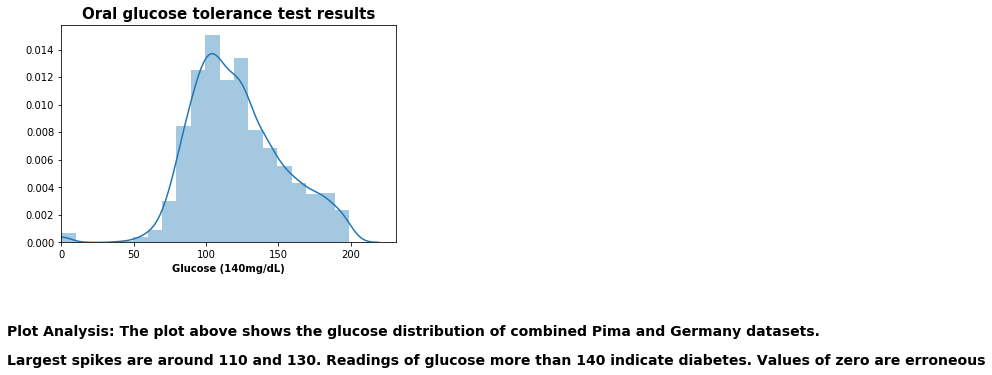


**<span style="background-color:yellow">Plot Analysis:</span> The plot above shows the glucose distribution of combined Pima and Germany datasets. Largest spikes are around 110 and 130.  
Readings of glucose more than 140 indicate diabetes. There are also errorneous values of '0'.** 


```python
sns.distplot(df_combined_orig['blood_pressure'],bins=20)
plt.xlim(0,None)
plt.xlabel('Blood pressure (mm Hg)',fontweight='bold')
plt.title('Diastolic blood pressure readings',fontsize=15, fontweight='bold')
textstr = "Plot Analysis: The plot above shows the blood pressure distribution of combined Pima and Germany datasets."
textstr2 = "Largest spikes are around 70 and 80. Readings of blood pressure more than 80 indicate high blood pressure. Values of zero are erroneous"
plt.gcf().text(0, -0.2, textstr, fontsize=14, fontweight='bold')
plt.gcf().text(0, -0.3, textstr2, fontsize=14, fontweight='bold')
plt.show()
```


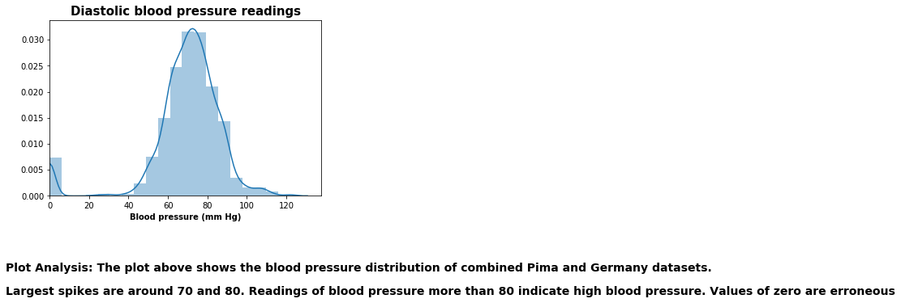


**<span style="background-color:yellow">Plot Analysis:</span> The plot above shows the blood pressure distribution of combined Pima and Germany datasets. Largest spikes are around 70 and 80.  
Readings of blood pressure more than 80 indicate high blood pressure. There are also errorneous values of '0'.**


```python
sns.distplot(df_combined_orig['skin_thickness'],bins=20)
plt.xlim(0,None)
plt.xlabel('Skin thickness (mm)',fontweight='bold')
plt.title('Triceps skin fold thickness',fontsize=15, fontweight='bold')
textstr = "Plot Analysis: The plot above shows skin fold thickness of combined Pima and Germany datasets."
textstr2 = "Largest spikes are around 30 mm. Normal measurements are around 23. Values of zero are erroneous"
plt.gcf().text(0, -0.2, textstr, fontsize=14, fontweight='bold')
plt.gcf().text(0, -0.3, textstr2, fontsize=14, fontweight='bold')
plt.show()
```


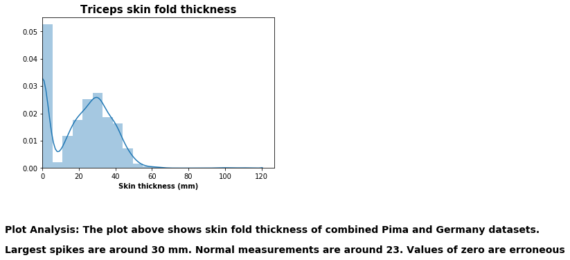


**<span style="background-color:yellow">Plot Analysis:</span> The plot above shows skin fold thickness of combined Pima and Germany datasets. Largest spikes are around 30 mm. Normal measurements are around 23. There are also errorneous values of '0'.**   


```python
sns.distplot(df_combined_orig['insulin'],bins=20)
plt.xlim(0,None)
plt.xlabel('Serum insulin mu U/ml',fontweight='bold')
plt.title('Serum insulin test results in mu U/ml',fontsize=15, fontweight='bold')
textstr = "Plot Analysis: The plot above shows the insulin test results of combined Pima and Germany datasets."
textstr2 = "Largest spikes are less than 50. Normal range is 16-166 mu U/ml. High insulin indicates diabetes. Values of zero are erroneous"
plt.gcf().text(0, -0.2, textstr, fontsize=14, fontweight='bold')
plt.gcf().text(0, -0.3, textstr2, fontsize=14, fontweight='bold')
plt.show()
```


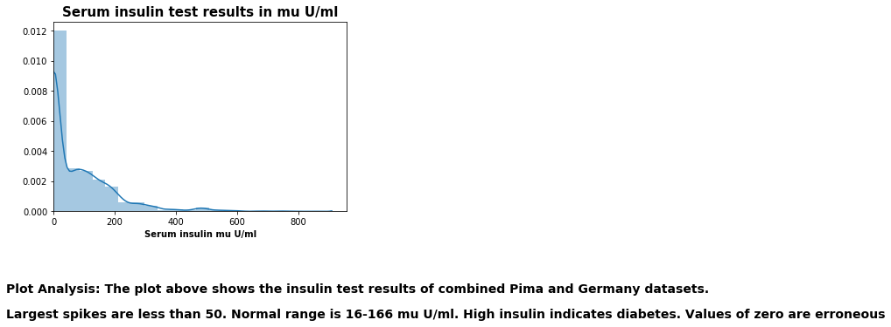


**<span style="background-color:yellow">Plot Analysis:</span> The plot above shows the serum insulin distribution for combined Pima and Germany datasets. Largest spikes are less than 50. The normal range is around 16-166 mu U/ml. High insulin levels indicate diabetes. There are also errorneous values of '0'**   


```python
sns.distplot(df_combined_orig['BMI'],bins=20)
plt.xlim(0,None)
plt.xlabel('BMI (kg/m2)',fontweight='bold')
plt.title('Body mass index',fontsize=15, fontweight='bold')
textstr = "Plot Analysis: The plot above shows the body mass index (BMI) for combined Pima and Germany datasets."
textstr2 = "Largest spikes are around 35 to 38. The normal range is 19-25. High values indicate overweight women. Values of zero are erroneous"
plt.gcf().text(0, -0.2, textstr, fontsize=14, fontweight='bold')
plt.gcf().text(0, -0.3, textstr2, fontsize=14, fontweight='bold')
plt.show()
```


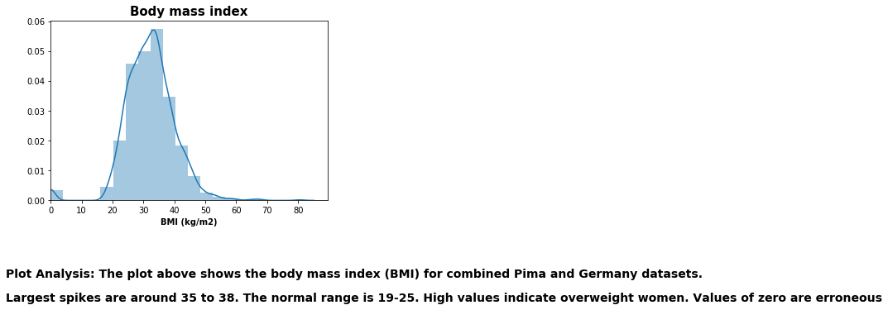


**<span style="background-color:yellow">Plot Analysis:</span> The plot above shows the body mass index (BMI) for combined Pima and Germany datasets. Largest spikes are around 35 to 38. The normal range is around 18.5 - 24.9. High BMI levels indicate overweight women. There are also errorneous values of '0'**


**<span style="background-color:yellow">NOTE:</span> The distribution of predictor variables 'glucose', 'blood_pressure', 'skin_thickness', 'insulin', and 'BMI' have outliers of value '0'. These '0' values are invalid since they are not humanly possible and will be replaced by NaN. <span style="background-color:yellow">The plots that follow contain the same Pima Indian and Germany datasets however the '0' values of the listed variables are replaced by NaN.</span>**


```python
# from the descriptive statistics minimum values of '0' do not make sense and are not valid 
# the variables from df_pima that have minimum of '0' are glucose, blood_pressure, skin_thickness, 
# insulin and BMI
col_list = ['glucose', 'blood_pressure', 'skin_thickness', 'insulin','BMI']
for col in col_list:
    pima_var_bool = df_pima[col] == 0
    pima_var_sum = pima_var_bool.sum()
    print(f"{col} : {pima_var_sum}")
 
```

    glucose : 5
    blood_pressure : 35
    skin_thickness : 227
    insulin : 374
    BMI : 11


```python
# from the descriptive statistics in df_germany a minimum value of '0' for the following variables 
# do not make sense : glucose, blood_pressure, skin_thickness, insulin and BMI
col_list = ['glucose', 'blood_pressure', 'skin_thickness', 'insulin','BMI']
for col in col_list:
    germany_var_bool = df_germany[col] == 0
    germany_var_sum = germany_var_bool.sum()
    print(f"{col} : {germany_var_sum}")
        
```

    glucose : 13
    blood_pressure : 90
    skin_thickness : 573
    insulin : 956
    BMI : 28


```python
# make copy of df_pima
df_pima_clean = df_pima.copy()
```


```python
# make copy of df_pima
df_germany_clean = df_germany.copy()
```


```python
# replace '0' values for the glucose', 'blood_pressure', 'skin_thickness', 'insulin','BMI' variables
# with NaN for the df_pima dataset
df_pima_clean[['glucose', 'skin_thickness', 'insulin', 'BMI', 'blood_pressure']] = \
df_pima_clean[['glucose', 'skin_thickness', 'insulin', 'BMI', 'blood_pressure']].replace(0, np.nan)
```


```python
# replace df_pima '0' values for the glucose', 'blood_pressure', 'skin_thickness', 'insulin','BMI' variables
# with NaN
df_germany_clean[['glucose', 'skin_thickness', 'insulin', 'BMI', 'blood_pressure']] = \
df_germany_clean[['glucose', 'skin_thickness', 'insulin', 'BMI', 'blood_pressure']].replace(0, np.nan)
```


```python
# combined dataset of Pima and Dutch women
df_combined_clean = df_pima_clean.append(df_germany_clean, ignore_index=True)
```


```python
df_combined_clean.head()
```


<div>
<style scoped>
    .dataframe tbody tr th:only-of-type {
        vertical-align: middle;
    }

    .dataframe tbody tr th {
        vertical-align: top;
    }

    .dataframe thead th {
        text-align: right;
    }
</style>
<table border="1" class="dataframe">
  <thead>
    <tr style="text-align: right;">
      <th></th>
      <th>pregnancies</th>
      <th>glucose</th>
      <th>blood_pressure</th>
      <th>skin_thickness</th>
      <th>insulin</th>
      <th>BMI</th>
      <th>diabetes_pedigree_function</th>
      <th>age</th>
      <th>outcome</th>
      <th>ethnicity</th>
    </tr>
  </thead>
  <tbody>
    <tr>
      <th>0</th>
      <td>6</td>
      <td>148.0</td>
      <td>72.0</td>
      <td>35.0</td>
      <td>NaN</td>
      <td>33.6</td>
      <td>0.627</td>
      <td>50</td>
      <td>1</td>
      <td>pima</td>
    </tr>
    <tr>
      <th>1</th>
      <td>1</td>
      <td>85.0</td>
      <td>66.0</td>
      <td>29.0</td>
      <td>NaN</td>
      <td>26.6</td>
      <td>0.351</td>
      <td>31</td>
      <td>0</td>
      <td>pima</td>
    </tr>
    <tr>
      <th>2</th>
      <td>8</td>
      <td>183.0</td>
      <td>64.0</td>
      <td>NaN</td>
      <td>NaN</td>
      <td>23.3</td>
      <td>0.672</td>
      <td>32</td>
      <td>1</td>
      <td>pima</td>
    </tr>
    <tr>
      <th>3</th>
      <td>1</td>
      <td>89.0</td>
      <td>66.0</td>
      <td>23.0</td>
      <td>94.0</td>
      <td>28.1</td>
      <td>0.167</td>
      <td>21</td>
      <td>0</td>
      <td>pima</td>
    </tr>
    <tr>
      <th>4</th>
      <td>0</td>
      <td>137.0</td>
      <td>40.0</td>
      <td>35.0</td>
      <td>168.0</td>
      <td>43.1</td>
      <td>2.288</td>
      <td>33</td>
      <td>1</td>
      <td>pima</td>
    </tr>
  </tbody>
</table>
</div>


```python
# number of nondiabetic women
no_diab = (df_combined_clean['outcome'] == 0).sum()
no_diab
```


    1816


```python
# number of nondiabetic women
diab = (df_combined_clean['outcome'] == 1).sum()
diab
```


    952


```python
# show countplot of outcome for df_pima_clean
#sns.countplot(x='outcome', data=df_pima_clean
ax = sns.countplot(x='outcome', data=df_combined_clean)
ax.set_xticklabels(["No Diabetes","Diabetes"], fontweight='bold')
plt.title('Count of nondiabetic and diabetic women for Pima and Dutch women',fontsize=15, fontweight='bold')
ax.set_xlabel('\nThe plot above shows 1816 nondiabetic and 952 diabetic women. \n\nThere is a higher percentage of nondiabetic versus diabetic women however the women in the dataset are mostly between 20 to 30 years old.',fontsize=14, fontweight='bold' )
ax.set_ylabel('Count',fontweight='bold')
textstr = "Plot Analysis: The plot above shows 1816 nondiabetic and 952 diabetic women."
textstr2 = "There is a higher percentage of nondiabetic versus diabetic women however the women in the dataset are mostly between 20 to 30 years old."

```


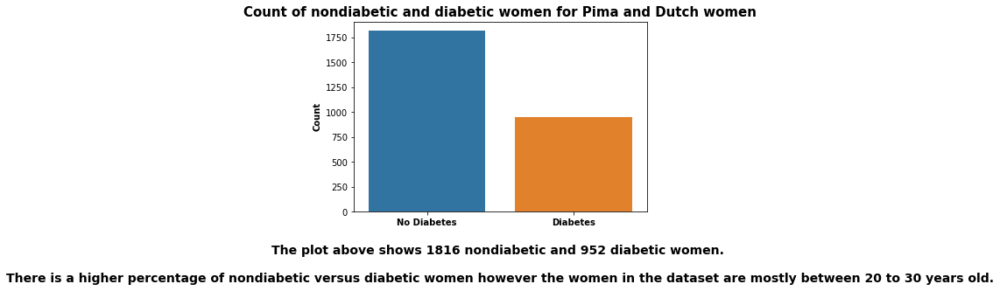


**<span style="background-color:yellow">Plot Analysis:</span> The plot above shows 1816 nondiabetic and 952 diabetic women.There is a higher percentage of nondiabetic versus diabetic women however the women in the dataset are mostly between 20 to 30 years old.**


```python
# show countplot of ages for combined database
plt.figure(figsize=(20,5))
ax = sns.countplot(x='age', data=df_combined_clean)
ax.set_xlabel('Age \n\nThe plot above shows a wide range of age groups. \nThe age groups with the highest counts are between 20 and 30. \nIn the Bivariate Section below the age category will be plotted against the diabetes outcome', fontweight='bold', fontsize=15)
ax.set_ylabel('Count', fontweight='bold', fontsize=15)
plt.title('Age groups of Pima and Dutch women',fontweight='bold', fontsize=15)
plt.xticks(rotation=90)
plt.show()
```


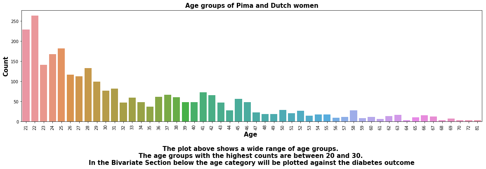


**<span style="background-color:yellow">Plot Analysis:</span> The plot above shows a wide range of age groups among the Pima Indian and Germany datasets. The age groups with the highest counts are between 20 and 30. In the Bivariate Section below the 'age' category will be plotted against the 'diabetes outcome'** 


```python
# show countplot of pregnancies for combined database
plt.figure(figsize=(20,5))
ax = sns.countplot(x='pregnancies', data=df_combined_clean)
ax.set_xlabel('Pregnancies \n\nThe plot above shows the number of pregnancies between zero and four.', fontweight='bold', fontsize=15)
ax.set_ylabel('Count', fontweight='bold', fontsize=15)
plt.title('Number of pregnancies for Pima and Dutch women',fontweight='bold', fontsize=15)
plt.xticks(rotation=90)
plt.show()
```


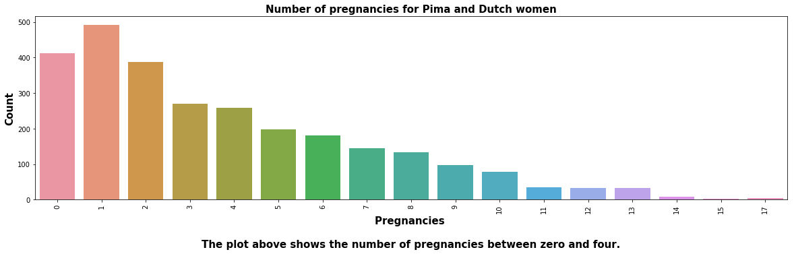


**<span style="background-color:yellow">Plot Analysis:</span> The plot above shows the number of pregnancies between zero and four.** 


```python
df_combined_clean.describe()
```


<div>
<style scoped>
    .dataframe tbody tr th:only-of-type {
        vertical-align: middle;
    }

    .dataframe tbody tr th {
        vertical-align: top;
    }

    .dataframe thead th {
        text-align: right;
    }
</style>
<table border="1" class="dataframe">
  <thead>
    <tr style="text-align: right;">
      <th></th>
      <th>pregnancies</th>
      <th>glucose</th>
      <th>blood_pressure</th>
      <th>skin_thickness</th>
      <th>insulin</th>
      <th>BMI</th>
      <th>diabetes_pedigree_function</th>
      <th>age</th>
      <th>outcome</th>
    </tr>
  </thead>
  <tbody>
    <tr>
      <th>count</th>
      <td>2768.000000</td>
      <td>2750.000000</td>
      <td>2643.000000</td>
      <td>1968.000000</td>
      <td>1438.000000</td>
      <td>2729.000000</td>
      <td>2768.000000</td>
      <td>2768.000000</td>
      <td>2768.000000</td>
    </tr>
    <tr>
      <th>mean</th>
      <td>3.742775</td>
      <td>121.895273</td>
      <td>72.404086</td>
      <td>29.289634</td>
      <td>154.237830</td>
      <td>32.596665</td>
      <td>0.471193</td>
      <td>33.132225</td>
      <td>0.343931</td>
    </tr>
    <tr>
      <th>std</th>
      <td>3.323801</td>
      <td>30.600655</td>
      <td>12.268576</td>
      <td>10.711518</td>
      <td>113.339578</td>
      <td>7.154020</td>
      <td>0.325669</td>
      <td>11.777230</td>
      <td>0.475104</td>
    </tr>
    <tr>
      <th>min</th>
      <td>0.000000</td>
      <td>44.000000</td>
      <td>24.000000</td>
      <td>7.000000</td>
      <td>14.000000</td>
      <td>18.200000</td>
      <td>0.078000</td>
      <td>21.000000</td>
      <td>0.000000</td>
    </tr>
    <tr>
      <th>25%</th>
      <td>1.000000</td>
      <td>99.000000</td>
      <td>64.000000</td>
      <td>22.000000</td>
      <td>76.250000</td>
      <td>27.500000</td>
      <td>0.244000</td>
      <td>24.000000</td>
      <td>0.000000</td>
    </tr>
    <tr>
      <th>50%</th>
      <td>3.000000</td>
      <td>117.000000</td>
      <td>72.000000</td>
      <td>29.000000</td>
      <td>126.000000</td>
      <td>32.400000</td>
      <td>0.375000</td>
      <td>29.000000</td>
      <td>0.000000</td>
    </tr>
    <tr>
      <th>75%</th>
      <td>6.000000</td>
      <td>141.000000</td>
      <td>80.000000</td>
      <td>36.000000</td>
      <td>190.000000</td>
      <td>36.800000</td>
      <td>0.624000</td>
      <td>40.000000</td>
      <td>1.000000</td>
    </tr>
    <tr>
      <th>max</th>
      <td>17.000000</td>
      <td>199.000000</td>
      <td>122.000000</td>
      <td>110.000000</td>
      <td>846.000000</td>
      <td>80.600000</td>
      <td>2.420000</td>
      <td>81.000000</td>
      <td>1.000000</td>
    </tr>
  </tbody>
</table>
</div>


## <span style="background-color:yellow">Bivariate Exploration</span>

**Bivariate exploration of the data will consist primarily of exploring the glucose and insulin variables.**

**The following statement is stated on the diabetes.org website (https://www.diabetes.org/diabetes-risk/prevention/high-blood-sugar):
"Understanding how sugar (glucose) and insulin work in your body is the foundation for knowing how diabetes works. By knowing what can affect your blood sugar levels, you can better manage it."**


```python
# plot of glucose and insulin in the blood. You would expect as the glucose levels go up the body needs
# to produce more insulin for glucose absorption. For high glucose and low insulin you would expect diabetes. 
# the dataframe used is 'df_glucose_insulin' which is filtered for NaN values
#If your insulin levels were too high, it may mean you have type 2 diabetes
ax = sns.regplot(x='glucose', y='insulin', data=df_combined_clean)
ax.set_xlabel('Glucose \n\nThe plot above shows a strong correlation between insulin and glucose. \nThe calcuated correlation coefficient is 0.5663.', fontweight='bold', fontsize=15)
ax.set_ylabel('Insulin', fontweight='bold', fontsize=15)
plt.title('Correlation between glucose and insulin',fontweight='bold', fontsize=15)
plt.show()
```


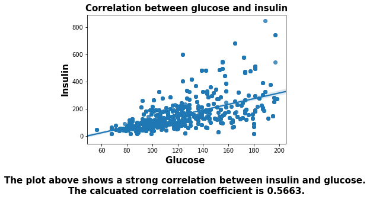


**<span style="background-color:yellow">Plot Analysis:</span> The plot above shows a strong correlation between insulin and glucose. The calcuated correlation coefficient is 0.5663 .**


```python
# correlation between glucose and insulin is positive.
# Corr method excludes nan values
df_combined_clean['glucose'].corr(df_combined_clean['insulin'])
```


    0.5663347094761794


```python
ax = sns.regplot(x='glucose', y='pregnancies', data=df_combined_clean)
ax.set_xlabel('Glucose \n\nThe plot above shows a weak correlation between pregnancies and glucose. \nThe calculated correlation coefficient is 0.1234.', fontweight='bold', fontsize=15)
ax.set_ylabel('Pregnancies', fontweight='bold', fontsize=15)
plt.title('Correlation between glucose and pregnancies',fontweight='bold', fontsize=15)
plt.show()
```


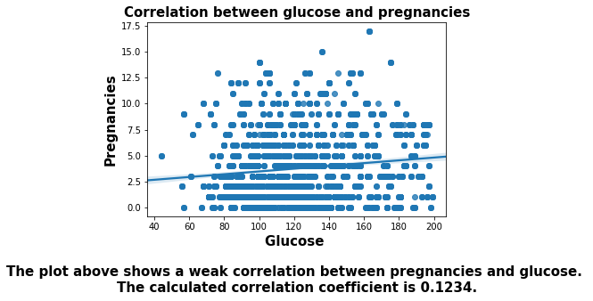


**<span style="background-color:yellow">Plot Analysis:</span> The plot above shows a weak correlation between pregnancies and glucose. The calculated correlation coefficient is 0.1234 .**


```python
df_combined_clean['glucose'].corr(df_combined_clean['pregnancies'])
```


    0.12341942099679325


```python
ax = sns.regplot(x='glucose', y='blood_pressure', data=df_combined_clean)
ax.set_xlabel('Glucose \n\nThe plot above shows a moderate correlation between blood pressure and glucose. \nThe calculated correlation coefficient is 0.2093.', fontweight='bold', fontsize=15)
ax.set_ylabel('Blood pressure', fontweight='bold', fontsize=15)
plt.title('Correlation between glucose and blood pressure',fontweight='bold', fontsize=15)
plt.show()
```


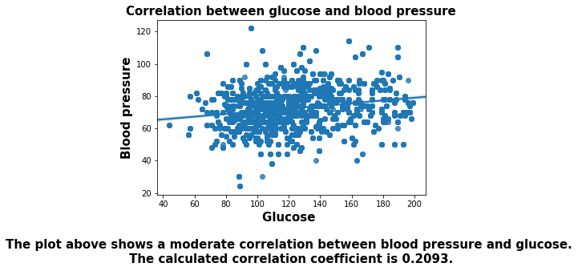


**<span style="background-color:yellow">Plot Analysis:</span> The plot above shows a moderate correlation between blood pressure and glucose. The calculated correlation coefficient is 0.2093 .**


```python
df_combined_clean['glucose'].corr(df_combined_clean['blood_pressure'])
```


    0.2092747919896563


```python
ax = sns.regplot(x='glucose', y='skin_thickness', data=df_combined_clean)
ax.set_xlabel('Glucose \n\nThe plot above shows a moderate correlation between skin thickness and glucose. \nThe calculated correlation coefficient is 0.2416.', fontweight='bold', fontsize=15)
ax.set_ylabel('Skin thickness', fontweight='bold', fontsize=15)
plt.title('Correlation between glucose and skin thickness',fontweight='bold', fontsize=15)
plt.show()
```


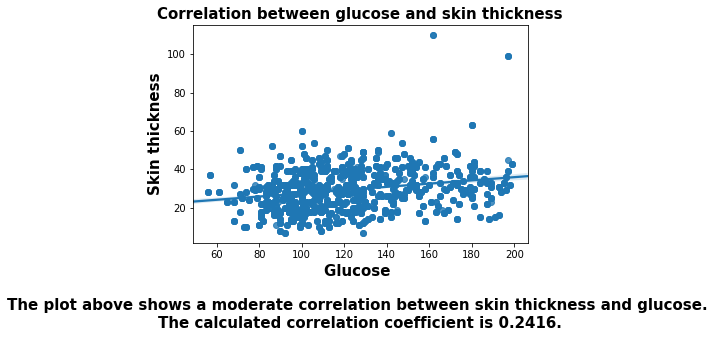


**<span style="background-color:yellow">Plot Analysis:</span> The plot above shows a moderate correlation between skin thickness and glucose. The calculated correlation coefficient is 0.2416 .**


```python
df_combined_clean['glucose'].corr(df_combined_clean['skin_thickness'])
```


    0.24160327448100427


```python
ax = sns.regplot(x='glucose', y='BMI', data=df_combined_clean)
ax.set_xlabel('Glucose \n\nThe plot above shows a moderate correlation between BMI and glucose. \nThe calculated correlation coefficient is 0.2341', fontweight='bold', fontsize=15)
ax.set_ylabel('BMI', fontweight='bold', fontsize=15)
plt.title('Correlation between glucose and BMI',fontweight='bold', fontsize=15)
plt.show()
```


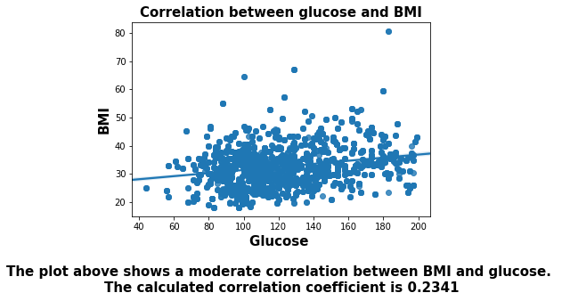


**<span style="background-color:yellow">Plot Analysis:</span> The plot above shows a moderate correlation between BMI and glucose. The calculated correlation coefficient is 0.2341 .**


```python
df_combined_clean['glucose'].corr(df_combined_clean['BMI'])
```


    0.23413632723713854


```python
ax = sns.regplot(x='glucose', y='diabetes_pedigree_function', data=df_combined_clean)
ax.set_xlabel('Glucose \n\nThe plot above shows a weak correlation between diabetes pedigree function and glucose. \nThe calculated correlation coefficient is 0.1279.', fontweight='bold', fontsize=15)
ax.set_ylabel('Diabetes pedigree fn', fontweight='bold', fontsize=15)
plt.title('Correlation between glucose and diabetes pedigree function',fontweight='bold', fontsize=15)
plt.show()
```


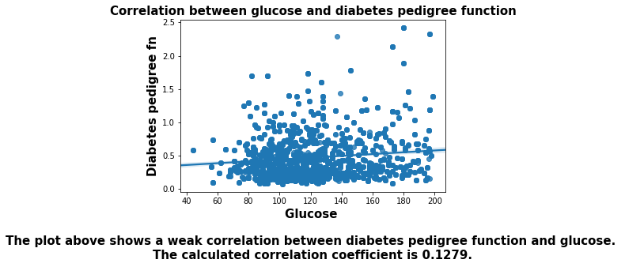


**<span style="background-color:yellow">Plot Analysis:</span> The plot above shows a weak correlation between diabetes pedigree function and glucose. The calculated correlation coefficient is 0.1279 .**


```python
df_combined_clean['glucose'].corr(df_combined_clean['diabetes_pedigree_function'])
```


    0.12792794186747322


```python
ax = sns.regplot(x='glucose', y='age', data=df_combined_clean)
ax.set_xlabel('Glucose \n\nThe plot above shows a moderate correlation between age and glucose. \nThe calculated correlation coefficient is 0.2622.', fontweight='bold', fontsize=15)
ax.set_ylabel('Age', fontweight='bold', fontsize=15)
plt.title('Correlation between glucose and age',fontweight='bold', fontsize=15)
plt.show()
```


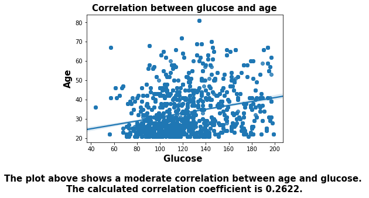


**<span style="background-color:yellow">Plot Analysis:</span> The plot above shows a moderate correlation between age and glucose. The calculated correlation coefficient is 0.2622 .**


```python
df_combined_clean['glucose'].corr(df_combined_clean['age'])
```


    0.2621845332783859


```python
col_list = ['pregnancies', 'blood_pressure', 'skin_thickness', 'insulin',\
       'BMI', 'diabetes_pedigree_function', 'age']
for col in col_list:
    correlation = df_combined_clean['glucose'].corr(df_combined_clean[col])
    print(f"{col} vs glucose : {correlation}")
        
```

    pregnancies vs glucose : 0.12341942099679325
    blood_pressure vs glucose : 0.2092747919896563
    skin_thickness vs glucose : 0.24160327448100427
    insulin vs glucose : 0.5663347094761794
    BMI vs glucose : 0.23413632723713854
    diabetes_pedigree_function vs glucose : 0.12792794186747322
    age vs glucose : 0.2621845332783859


**<span style="background-color:yellow">Note:</span> The variables 'blood_pressure', 'skin_thickness', 'insulin', 'BMI', and 'age' have the highest correlations with 'glucose' (larger than 0.2).**


```python
# boxplot of 'glucose' versus 'outcome'
ax = sns.boxplot(data=df_combined_clean, x='outcome', y='glucose')
plt.title('Distribution of nondiabetic versus diabetic women and their glucose levels',fontsize=15, fontweight='bold')
ax.set_xlabel('\n\nThe plot above shows that glucose levels are higher for diabetic women than for nondiabetic women.',fontsize=15, fontweight='bold')
ax.set_ylabel('Glucose',fontweight='bold')
ax.set_xticklabels(["No Diabetes","Diabetes"], fontweight='bold')
plt.show()
```


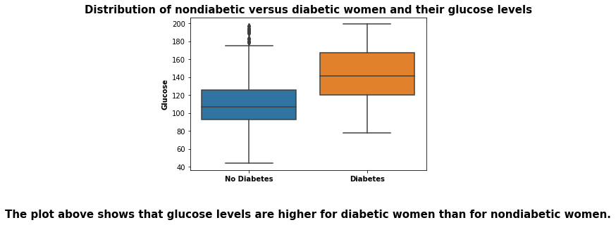


**<span style="background-color:yellow">Plot Analysis:</span> The plot above shows that glucose levels are higher for diabetic women than for nondiabetic women.**


```python
# boxplot of 'glucose' versus 'ethnicity'
ax = sns.boxplot(data=df_combined_clean, x='ethnicity', y='glucose')
plt.title('Distribution of Pima Indians versus Dutch women and their glucose levels',fontsize=15, fontweight='bold')
ax.set_xlabel('\n\nThe plot above shows that glucose levels are roughly the same for Pima Indian versus Dutch women.',fontsize=15, fontweight='bold')
ax.set_ylabel('Glucose',fontweight='bold')
ax.set_xticklabels(["Pima Indians","Dutch"], fontweight='bold')
plt.show()
```


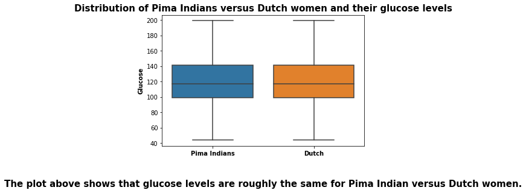


**<span style="background-color:yellow">Plot Analysis:</span> The plot above shows that glucose levels are roughly the same for Pima Indian versus Dutch women.**

## <span style="background-color:yellow">Multivariate Exploration</span>


```python
# similar graph as above comparing glucose with insulin grouped by ethnicity
ax = sns.lmplot(x='glucose', y='insulin', data=df_combined_clean, fit_reg=True, hue='ethnicity',\
               markers=["o", "x"],scatter_kws={'alpha': 0.3}, legend=False)
plt.title('Correlation of glucose and insulin grouped by ethnicity',fontsize=15, fontweight='bold')
plt.xlabel('Glucose \n\nFrom the plot shown above, the Pima women have slightly higher correlation data points \nbetween glucose and insulin than the Dutch women.',fontweight='bold', fontsize=15)
plt.ylabel('Insulin',fontweight='bold', fontsize=15)
legend_properties = {'weight':'bold', "size":15}
plt.legend(["Pima Indian", "Dutch"], prop=legend_properties)
plt.show()
```


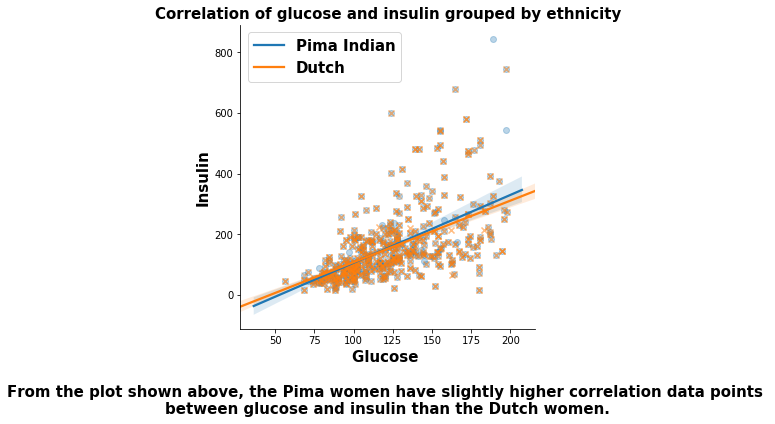


**<span style="background-color:yellow">Note: </span> From the plot shown above, the Pima women have slightly higher correlation data points between glucose and insulin than the Dutch women.**


```python
# how do the predictor variables correlate with each other for both pima and dutch women
sns.set(font_scale=1.2)
sns.heatmap(df_combined_clean.corr(),cmap="YlGnBu", linecolor='white', linewidths=1)
plt.title('Correlation of numerical variables for combined Pima Indian and Germany datasets',fontsize=20,\
          fontweight='bold')
plt.gcf().text(-0.2, -0.6, 'From the heatmap shown above, the variables glucose, insulin and BMI are \nmore correlated with diabetic outcome than the other variables in the dataset.', fontsize=20, fontweight='bold')
plt.show()
```


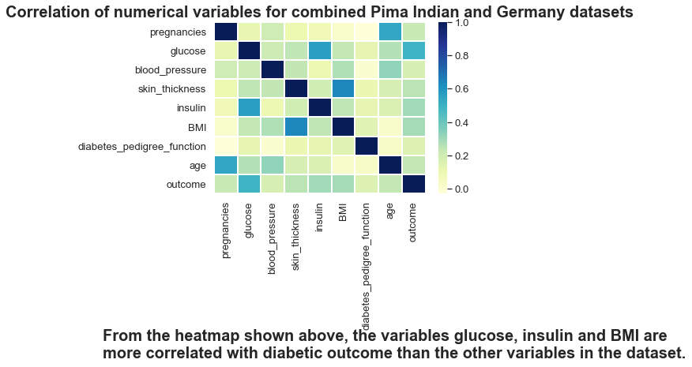


**<span style="background-color:yellow">Note: </span> From the heatmap shown above, 'glucose', 'insulin' and 'BMI' are more correlated with diabetic 'outcome' than the other variables in the dataset.**


```python
# catplot of ethnicity as x-value and each of the eight variables to find which variable is most
# likely contributes to the fact that the mean of the diabetes outcomes is greater for the Pima 
# women than that for the Ductch women
```


```python
fig, axs = plt.subplots(2,4,figsize=(15,10))

sns.catplot(data=df_combined_clean, x='ethnicity', y='pregnancies', kind='point', ax=axs[0,0])
sns.catplot(data=df_combined_clean[df_combined_clean.glucose.notnull()],x='ethnicity', y='glucose', \
            kind='point', ax=axs[0,1]) 
sns.catplot(data=df_combined_clean[df_combined_clean.blood_pressure.notnull()], x='ethnicity', y='blood_pressure',\
            kind='point', ax=axs[0,2])
sns.catplot(data=df_combined_clean[df_combined_clean.skin_thickness.notnull()], x='ethnicity', y='skin_thickness',\
            kind='point', ax=axs[0,3])
sns.catplot(data=df_combined_clean[df_combined_clean.insulin.notnull()], x='ethnicity', y='insulin',\
            kind='point', ax=axs[1,0])
sns.catplot(data=df_combined_clean[df_combined_clean.BMI.notnull()], x='ethnicity', y='BMI',\
            kind='point', ax=axs[1,1])
sns.catplot(data=df_combined_clean, x='ethnicity', y='diabetes_pedigree_function', kind='point', ax=axs[1,2])
sns.catplot(data=df_combined_clean, x='ethnicity', y='age', kind='point', ax=axs[1,3])
fig.suptitle('Mean of numerical variables grouped by Pima and Dutch categories', fontsize=20, fontweight='bold')
plt.close(2)
plt.close(3)
plt.close(4)
plt.close(5)
plt.close(6)
plt.close(7)
plt.close(8)
plt.close(9)
plt.close(10)
fig.tight_layout()
```


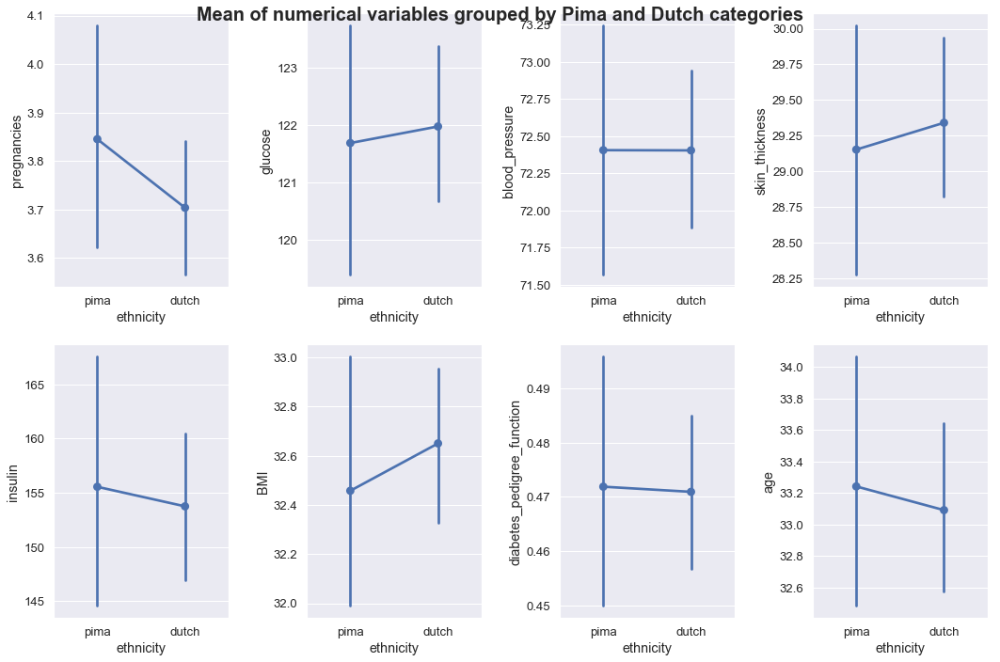


**<span style="background-color:yellow">Note: </span> In the group of subplots labeled <span style="background-color:yellow">'Mean of numerical variables grouped by Pima and Dutch categories'</span>, it can be seen that the variables with the largest mean differences are glucose, skin thickness, insulin, BMI, and age.  
Pima has higher mean for pregnancies, insulin, and age. There is a slight higher mean for diabetes pedigree function.  This might help explain why the diabetic outcome mean for Pima is higher than that for Dutch women as shown in the plot below.**


```python
sns.catplot(data=df_combined_clean, x='ethnicity', y='outcome', kind='point')
plt.title('Mean of diabetic outcomes grouped by Pima and Dutch categories', fontsize=20, fontweight='bold')
plt.gcf().text(-0.2, -0.1, 'The diabetic outcome mean for Pima is slightly higher than that for Dutch women as shown in the plot above.', fontsize=16, fontweight='bold')
plt.gcf().text(-0.2, -0.2,'Mean of diabetic outcome for Pima Indian women is 0.349 (34.9%)',fontsize=16, fontweight='bold')
plt.gcf().text(-0.2, -0.3,'Mean of diabetic outcome for Dutch women is 0.342 (34.2%).',fontsize=16, fontweight='bold')
plt.show()
```


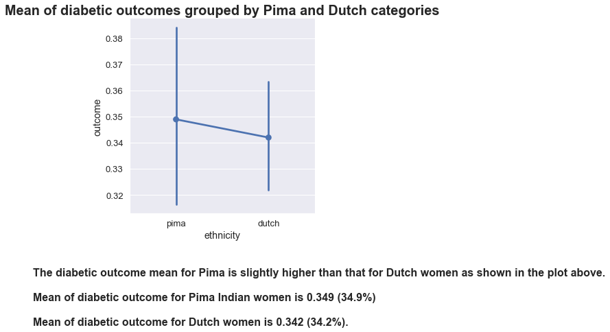


**<span style="background-color:yellow">Note: </span> The diabetic outcome mean for Pima is slightly higher than that for Dutch women as shown in the plot above.** 


```python
mean_pima = round(df_pima_clean['outcome'].mean(),3)
mean_pima
```


    0.349


**<span style="background-color:yellow">Note: </span>Mean of diabetic outcome for Pima Indian women is <span style="background-color:yellow">0.349 (34.9%)</span>**


```python
mean_germany = df_germany_clean['outcome'].mean()
mean_germany
```


    0.342


**<span style="background-color:yellow">Note: </span> Mean of diabetic outcome for Dutch women is <span style="background-color:yellow">0.342  (34.2%).</span>**


```python
mean_difference = mean_pima - mean_germany
print(round(mean_difference, 3))
```

    0.007


```python
pima_list = df_pima_clean['outcome'].tolist()
dutch_list = df_germany_clean['outcome'].tolist()
```


```python
all_values = pima_list + dutch_list
```


```python
len(all_values)
```


    2768


```python
# To simulate rerunning the study, we randomly reassign each data point (outcome) to either group A (Pima women)
# or group B (Dutch women).
import numpy
mean_differences = []
for x in range(1000):
    group_a = []
    group_b = []
    for y in all_values:
        value = numpy.random.rand()
        if value >= 0.5:
            group_a.append(y)
        else:
            group_b.append(y)
    #mean_group_b = round(np.mean(df_pima['outcome']),3)
    mean_group_b = np.mean(df_pima_clean['outcome'])
    mean_group_a = np.mean(df_germany_clean['outcome'])
    iteration_mean_difference = mean_group_b - mean_group_a
    mean_differences.append(iteration_mean_difference)
plt.hist(mean_differences)
plt.title('Mean differences of diabetic outcome for Pima and Dutch women', fontsize=20, fontweight='bold')
plt.gcf().text(-0.2, -0.1,'From the plot shown above, we can conclude that the diabetic outcome mean differences are close to 0 and \nthat the Pima and Dutch women are roughly equally diabetic.',fontsize=15, fontweight='bold')
plt.gcf().text(-0.2, -0.3,'The null hypothesis test is that there is NO difference in diabetic means between Pima and Dutch women. \nThe alternative hypothesis is that there is a difference.',fontsize=15, fontweight='bold')
plt.gcf().text(-0.2, -0.4,'Since p-value of 0.686 is greater than alpha of 0.05 (confidence interval or 95%), we accept the null hypothesis.',fontsize=15, fontweight='bold') 
plt.show()
```


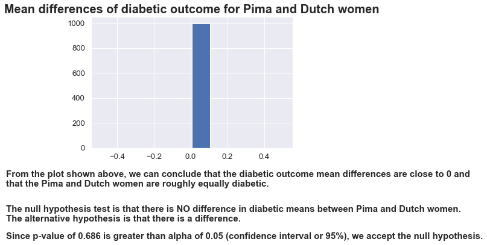


**<span style="background-color:yellow">Plot Analysis: </span> From the plot shown above, we can conclude that the diabetic outcome mean differences are close to '0' and that the Pima and Dutch women are roughly equally diabetic.** 


```python
from scipy import stats

stats.ttest_1samp(pima_list, 0.342)
```


    Ttest_1sampResult(statistic=0.40430743910226374, pvalue=0.686099368413374)


**<span style="background-color:yellow">Note: </span> The null hypothesis test is that there is NO difference in diabetic means between Pima and Dutch women.  
The alternative hypothesis is that there is a difference.  
Since p-value of 0.686 is greater than alpha of 0.05 (confidence interval or 95%), we accept the null hypothesis.** 


```python

```
